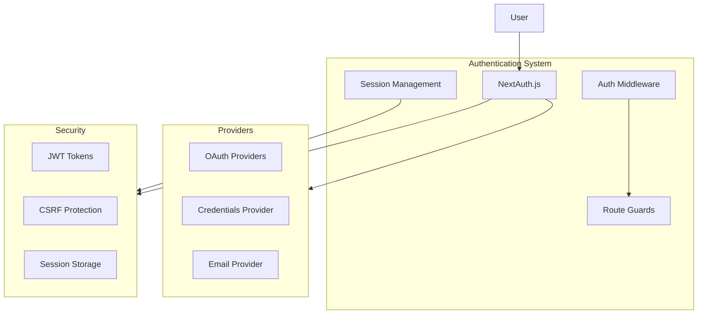
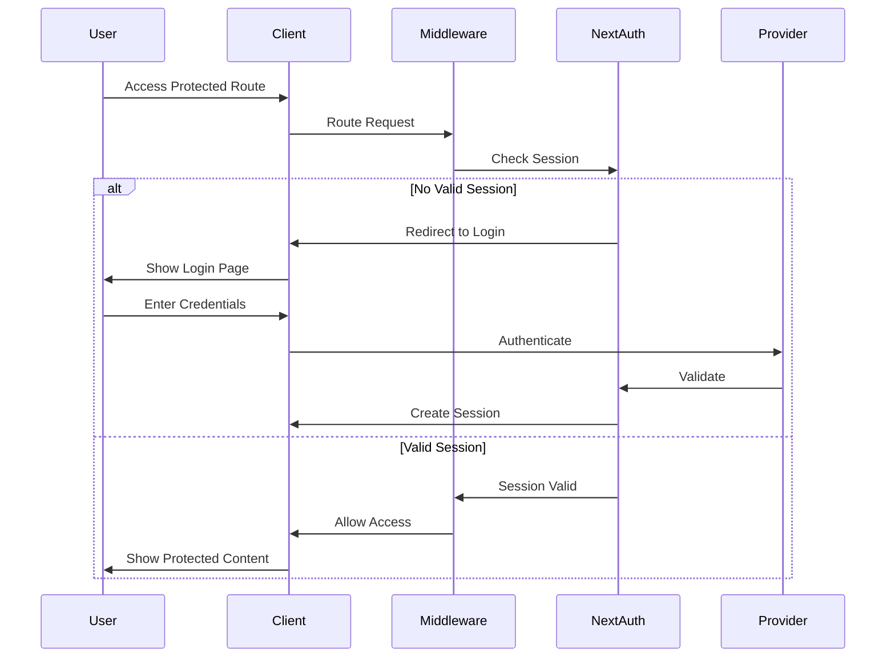
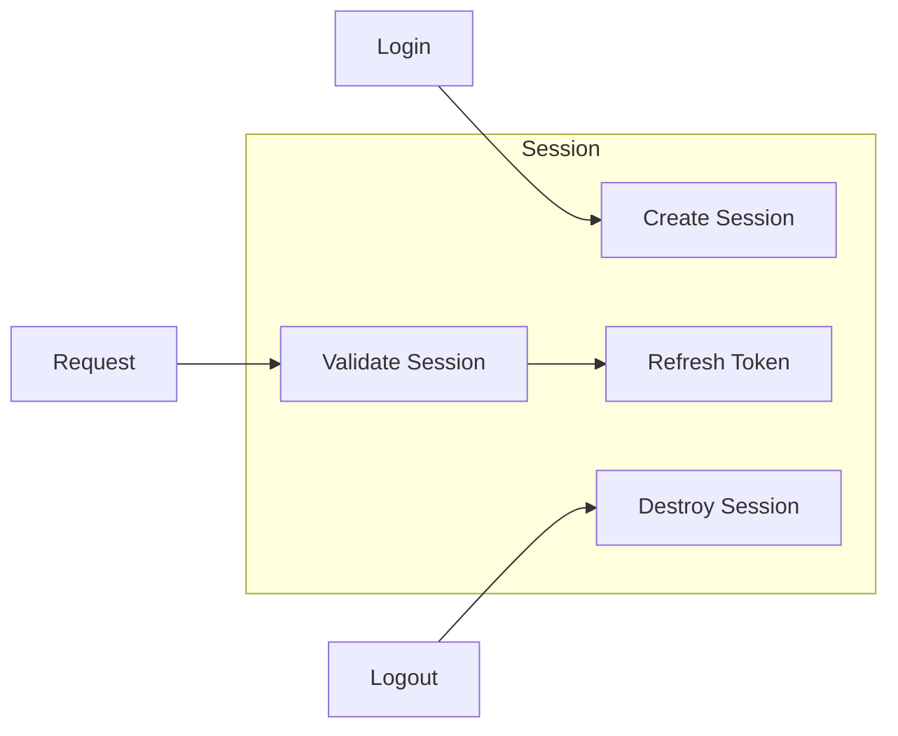
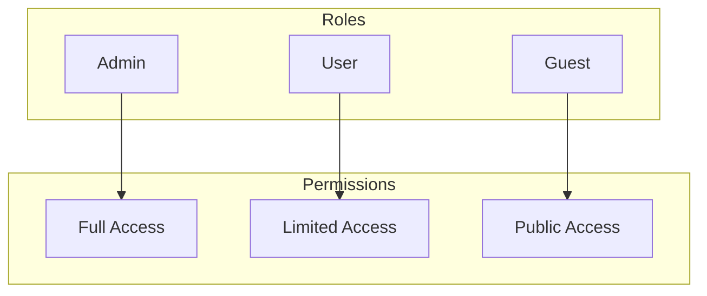
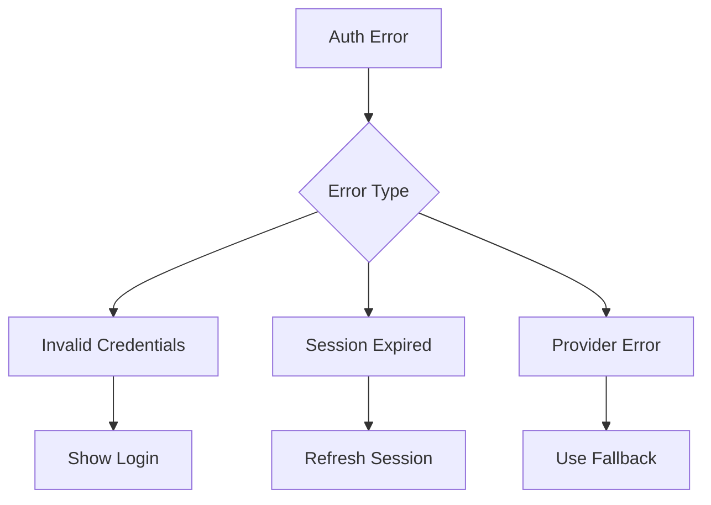

# Authentication System Documentation

## Overview

The authentication system in the Next.js Admin Dashboard provides secure user authentication and authorization using NextAuth.js. It supports multiple authentication providers and implements role-based access control.

## Architecture



## Key Components

### NextAuth Configuration

Located in `src/lib/auth.config.ts`, defines:

- Authentication providers
- Session strategy
- Callback functions
- Custom pages

### Auth Middleware

Located in `src/middleware.ts`:

- Protects routes
- Validates sessions
- Handles redirects

## Authentication Flow



## Features

### Multi-provider Authentication

- OAuth (Google, GitHub, etc.)
- Email/Password
- Magic Links

### Session Management



### Role-based Access Control



## Security Considerations

### Token Management

- JWT token configuration
- Token rotation
- Secure storage

### Protection Mechanisms

- CSRF tokens
- Rate limiting
- Session validation

## Error Handling



## Usage Examples

### Protected API Route

```typescript
// Example from src/app/api/protected/route.ts
export async function GET(request: Request) {
  const session = await getServerSession();
  if (!session) {
    return new Response('Unauthorized', { status: 401 });
  }
  // Protected route logic
}
```

### Protected Page

```typescript
// Example from src/app/dashboard/page.tsx
export default async function DashboardPage() {
  const session = await getServerSession();
  if (!session) {
    redirect('/auth/signin');
  }
  // Protected page content
}
```

## Testing

- Unit tests for auth functions
- Integration tests for auth flow
- E2E tests for user scenarios

## Monitoring

- Auth success/failure rates
- Session metrics
- Security events

## Future Improvements

1. Additional auth providers
2. Enhanced MFA support
3. Advanced role management
4. Improved session analytics

## Troubleshooting

- Common auth errors
- Debug strategies
- Support resources
