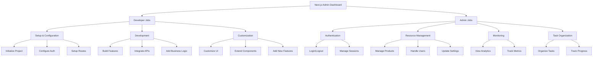
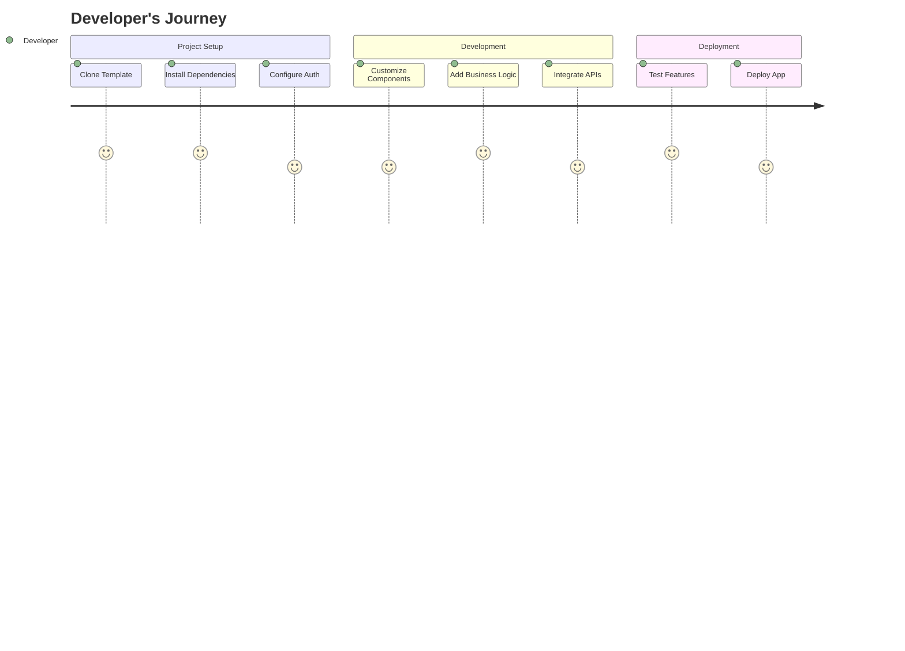
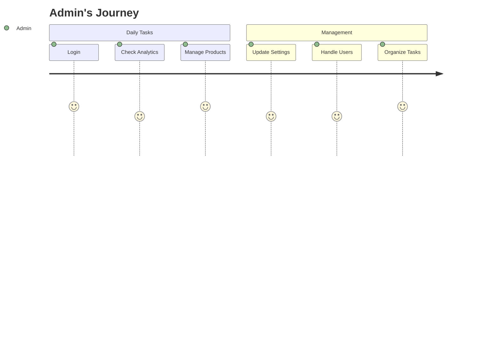
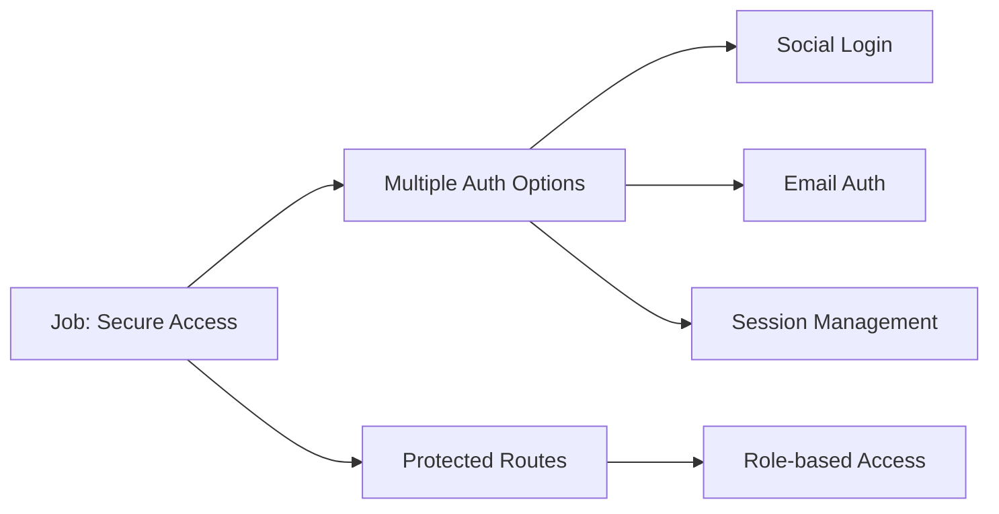
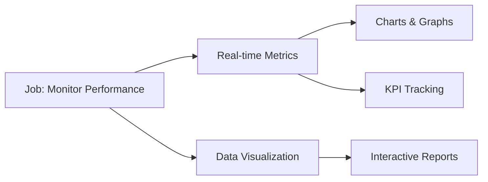
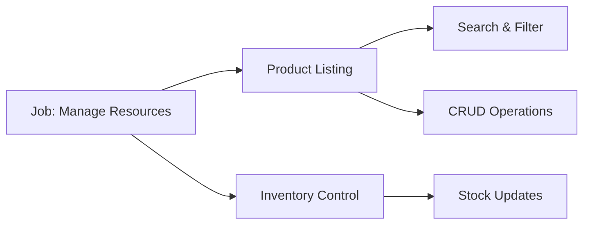
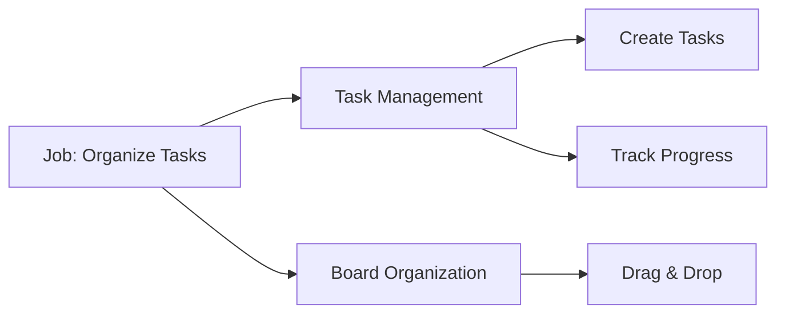

# Jobs to be Done Analysis - Next.js Admin Dashboard

## Overview
This document analyzes the Next.js Admin Dashboard template through the Jobs to be Done (JTBD) framework, identifying the core jobs, outcomes, and scenarios that users aim to accomplish.

## Core Job Statements

### Developer Job Statement
*When I need to build an admin dashboard quickly,
I want to use a production-ready template with modern features,
So I can focus on business logic rather than building common dashboard components from scratch.*

### Admin Job Statement
*When I need to manage my application's resources and monitor performance,
I want an intuitive and feature-rich dashboard interface,
So I can efficiently handle administrative tasks and make data-driven decisions.*

## Job Map Hierarchy

## Job Scenarios and Outcomes

### Developer Scenarios

#### Expected Outcomes
1. Reduced development time
2. Production-ready features available
3. Modern tech stack implementation
4. Scalable architecture
5. Maintainable codebase

### Admin Scenarios

#### Expected Outcomes
1. Efficient resource management
2. Clear performance insights
3. Organized task tracking
4. Streamlined workflows
5. Improved decision making

## Feature Analysis Through JTBD Lens

### Authentication System

### Dashboard Analytics

### Product Management

### Kanban Board

## Job-Feature Matrix

| Job to be Done | Key Features | Success Metrics |
|----------------|--------------|------------------|
| Quick Project Setup | Project Structure, Pre-built Components | Setup Time < 1 hour |
| Secure Authentication | Multiple Auth Providers, Protected Routes | Zero Security Breaches |
| Resource Management | CRUD Operations, Search & Filter | Task Completion Rate |
| Performance Monitoring | Real-time Analytics, KPI Tracking | Data Accuracy |
| Task Organization | Kanban Board, Progress Tracking | Project Completion Rate |

## Conclusion
The Next.js Admin Dashboard successfully addresses the core jobs to be done for both developers and administrators. By providing a comprehensive set of features and an intuitive interface, it enables efficient development and management of administrative tasks while maintaining flexibility for customization and scalability.