# Kanban Board Documentation

## Overview

The Kanban Board feature provides a visual task management system within the admin dashboard. This document details the technical implementation and architecture of the Kanban board functionality.

## Architecture

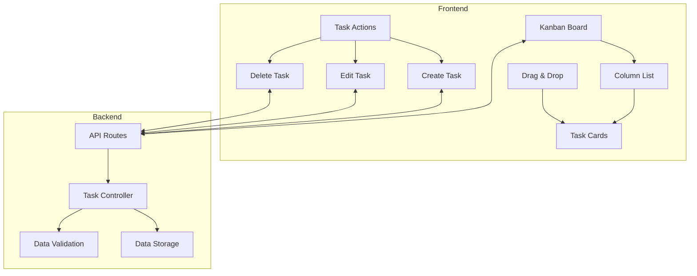

## Component Structure

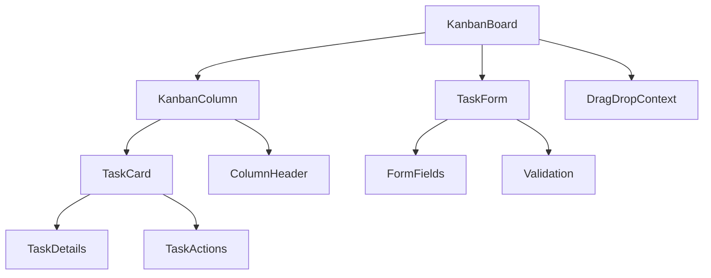

## Drag and Drop Flow

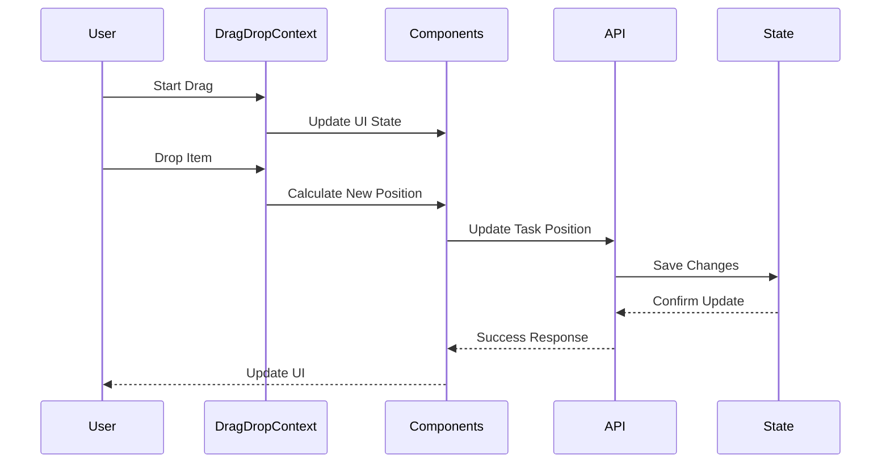

## State Management

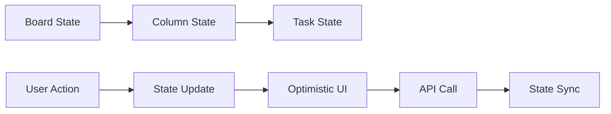

## Task Operations

### Create Task Flow

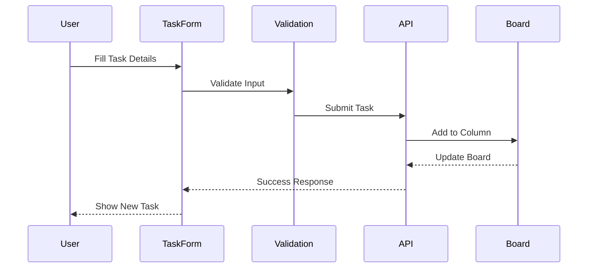

### Update Task Status

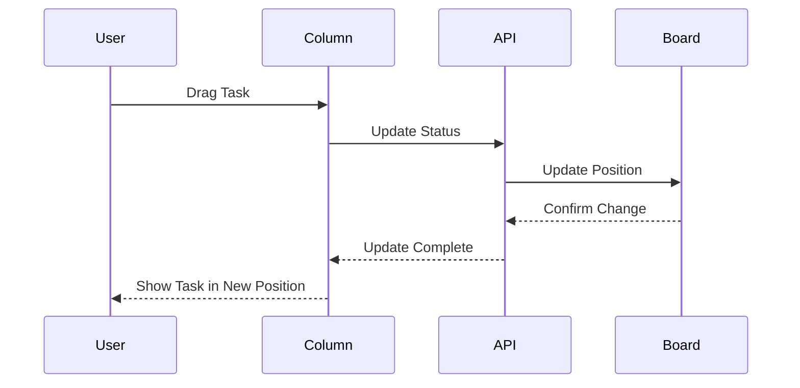

## Data Model

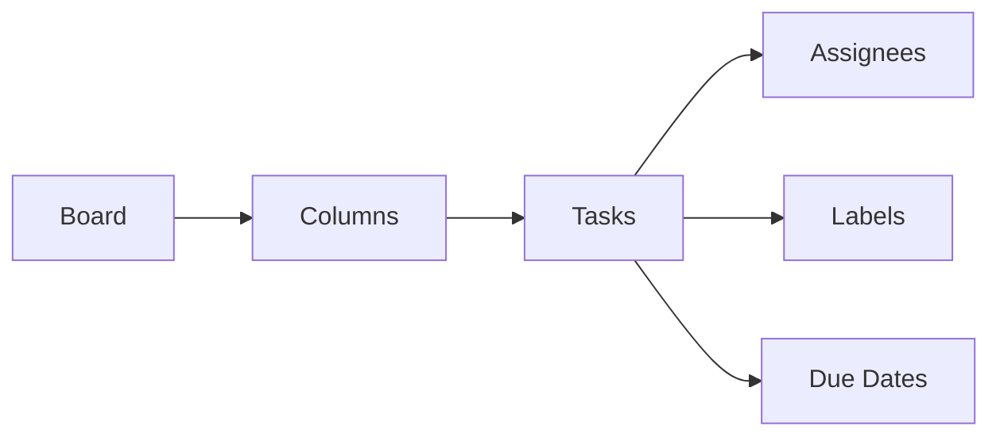

## Error Handling

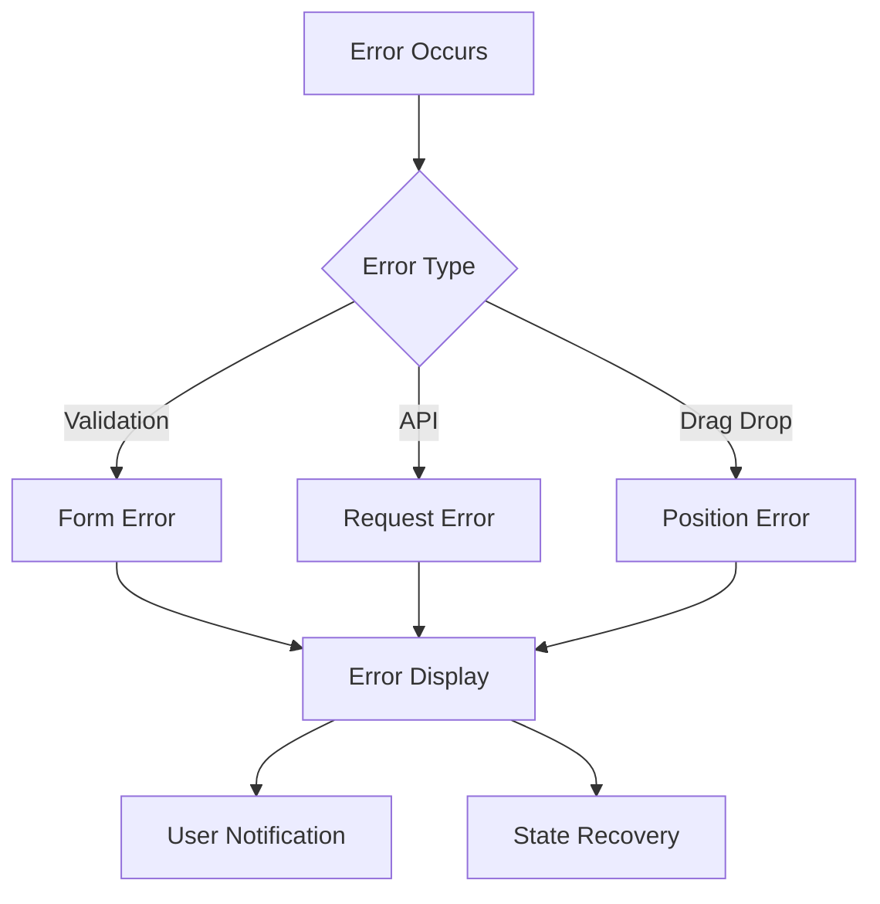

## Performance Optimizations

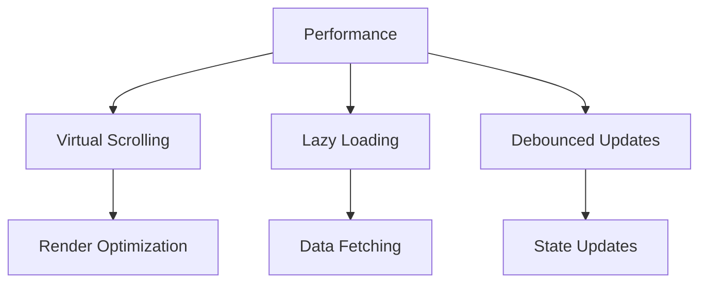

## Security Measures

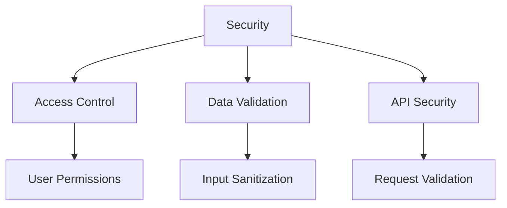

## API Endpoints

### Task Routes

- `GET /api/boards/:id/tasks` - List tasks
- `POST /api/boards/:id/tasks` - Create task
- `PUT /api/boards/:id/tasks/:taskId` - Update task
- `DELETE /api/boards/:id/tasks/:taskId` - Delete task
- `PATCH /api/boards/:id/tasks/:taskId/position` - Update task position

## Event Handling

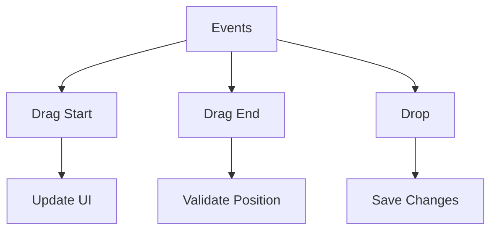

## Testing Strategy

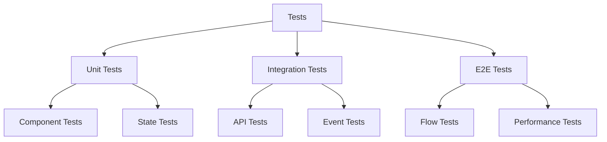

## Monitoring

- Task creation/update rates
- Board performance metrics
- Drag and drop success rates
- Error tracking
- User interaction patterns

## Future Enhancements

1. **Features**

   - Subtasks support
   - Task dependencies
   - Custom workflows
   - Time tracking

2. **Performance**

   - Real-time updates
   - Improved drag and drop
   - Better state management

3. **UX Improvements**
   - Column customization
   - Advanced filters
   - Task templates
   - Keyboard shortcuts
