# Product Management System Documentation

## Overview

The Product Management system provides a comprehensive interface for managing products within the admin dashboard. This document details the technical implementation and architecture of the product management features.

## Architecture

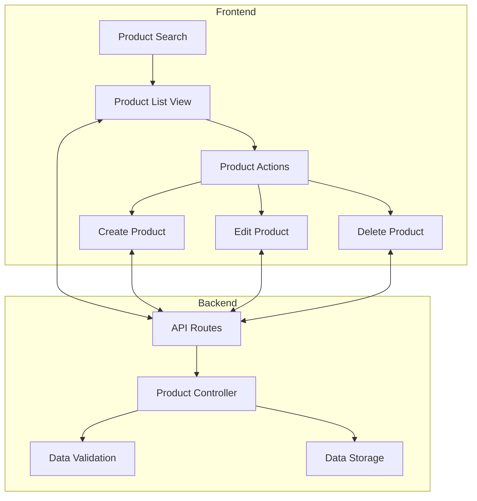

## Component Structure

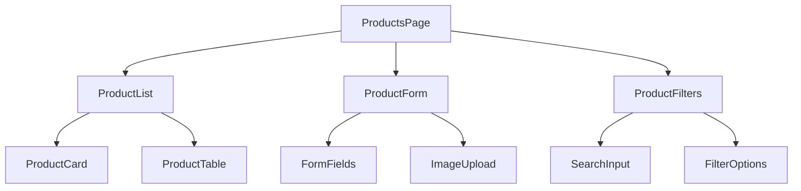

## Data Flow

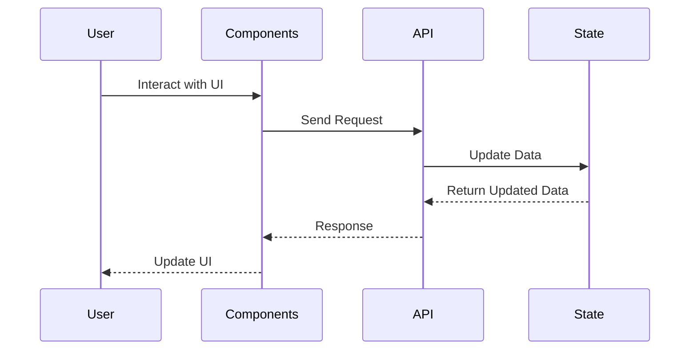

## State Management

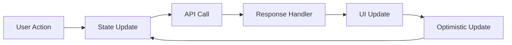

## CRUD Operations

### Create Product Flow

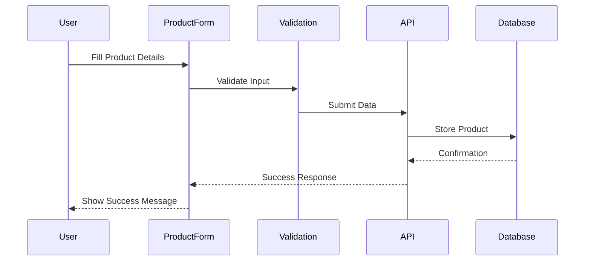

### Update Product Flow

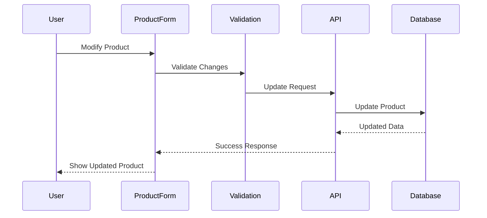

## Search and Filter Implementation

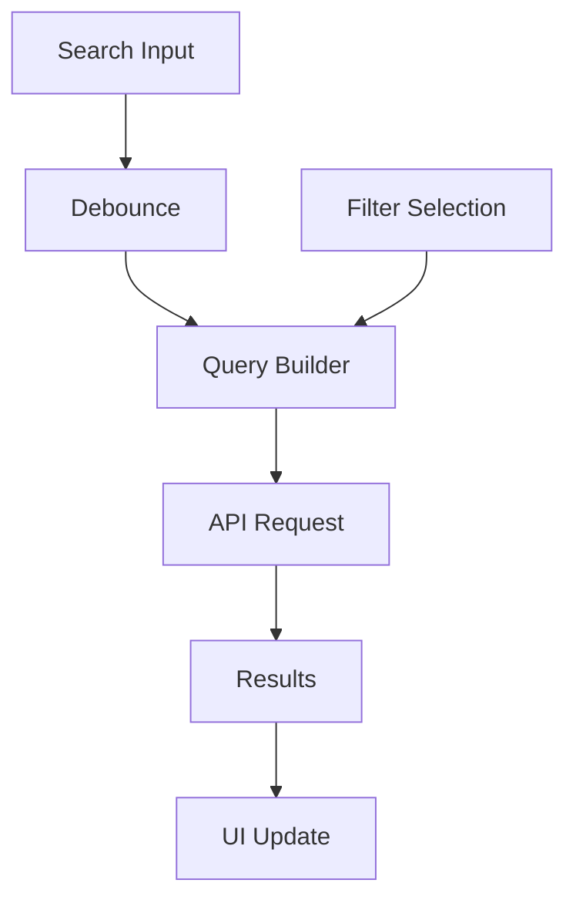

## Error Handling

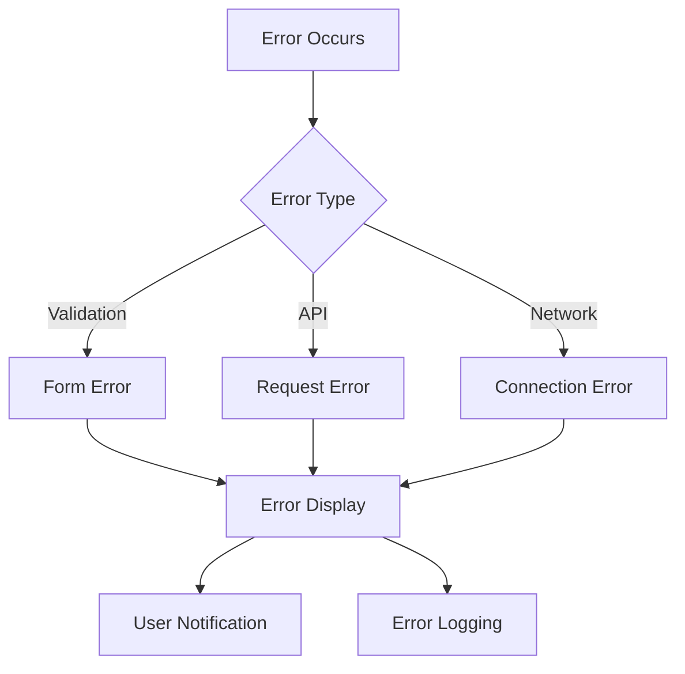

## Performance Optimizations

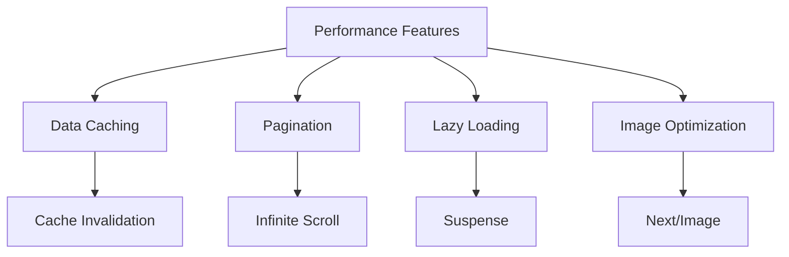

## Security Measures

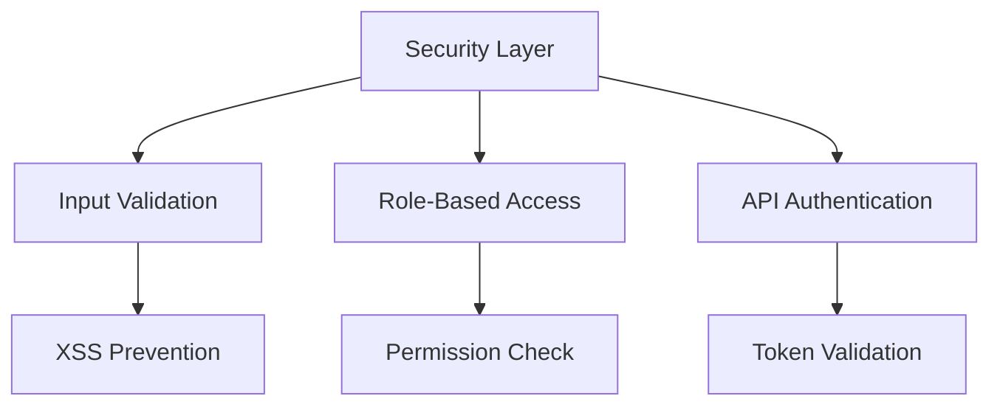

## API Endpoints

### Product Routes

- `GET /api/products` - List products
- `POST /api/products` - Create product
- `PUT /api/products/:id` - Update product
- `DELETE /api/products/:id` - Delete product
- `GET /api/products/search` - Search products

## Data Validation

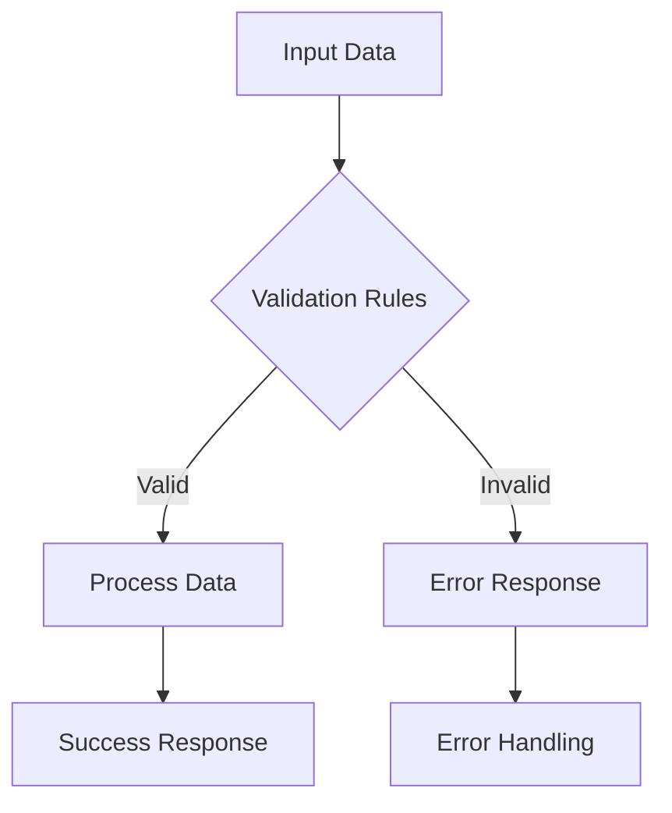

## Testing Strategy

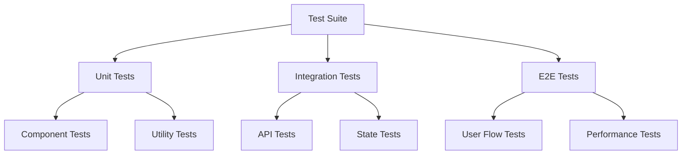

## Monitoring and Analytics

- Product creation/update rates
- Search performance metrics
- Error rates and types
- API response times
- User interaction patterns

## Future Enhancements

1. **Features**

   - Bulk operations
   - Advanced filtering
   - Product variants
   - Inventory tracking

2. **Performance**

   - Real-time updates
   - Enhanced caching
   - Search optimization

3. **UX Improvements**
   - Drag-and-drop interface
   - Batch editing
   - Custom views
   - Export/Import functionality
