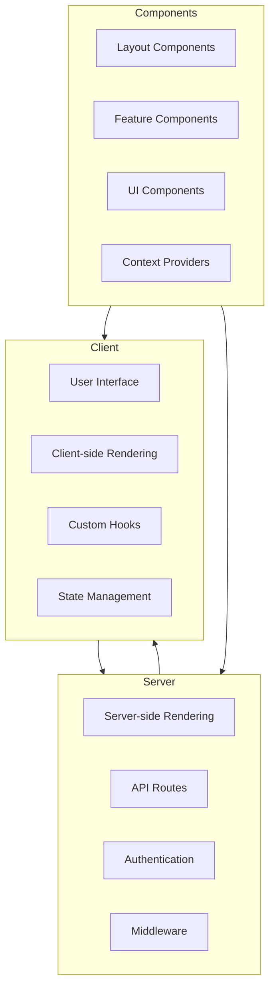
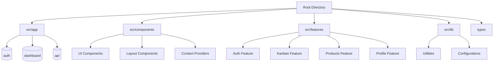
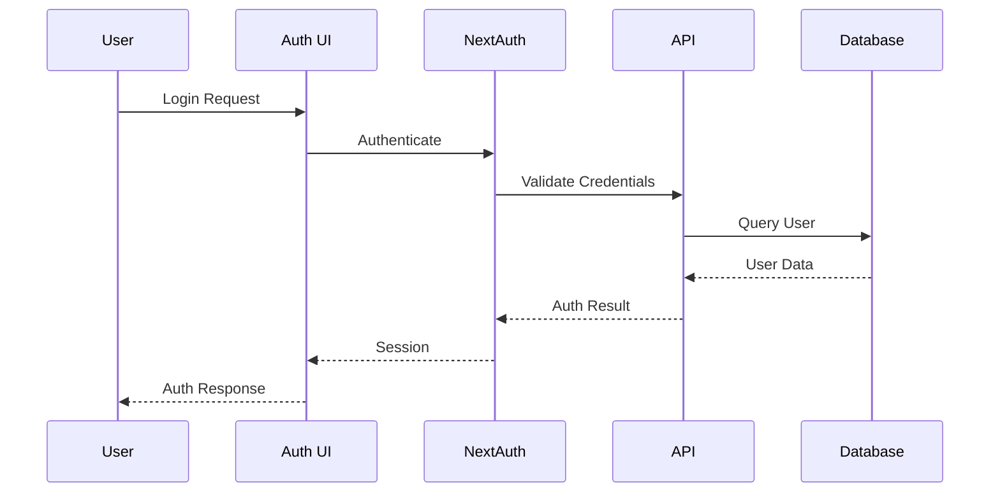
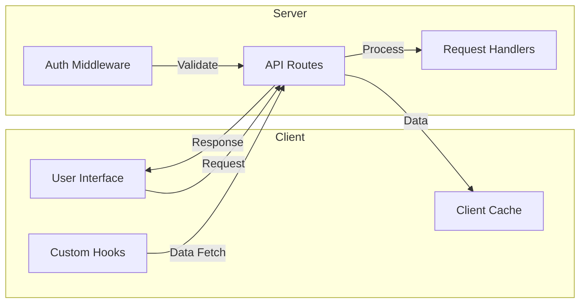
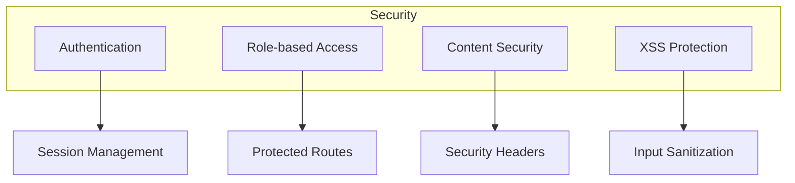
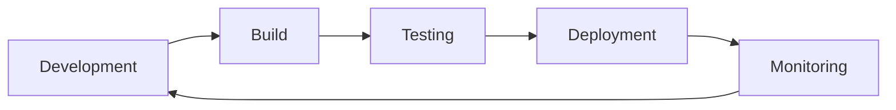
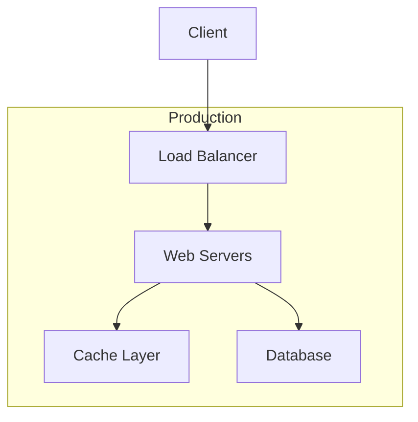

# Technical Architecture Documentation

## System Overview
The Next.js Admin Dashboard is a modern web application built using Next.js 13+, featuring a robust architecture that combines server-side rendering, client-side interactivity, and a modular component structure.

## Architecture Diagram

## Core Technologies
- **Next.js 13+**: Framework for server-side rendering and routing
- **React**: UI component library
- **TypeScript**: Type-safe development
- **Tailwind CSS**: Utility-first styling
- **Shadcn/ui**: Component library
- **NextAuth.js**: Authentication system

## Directory Structure

## Key Components

### Authentication System

### Data Flow

## Design Patterns

### Component Architecture
- **Atomic Design**: UI components are organized following atomic design principles
- **Compound Components**: Complex UI elements are built using compound component pattern
- **Provider Pattern**: Context providers for state management and theme

### State Management
- **React Context**: Global state management
- **Custom Hooks**: Encapsulated state logic
- **Server State**: Managed through API routes

### Performance Optimization
- **Code Splitting**: Automatic code splitting by Next.js
- **Image Optimization**: Next.js Image component
- **Dynamic Imports**: Lazy loading of components

## Security Measures

## Integration Points

### External Services
- Authentication providers
- API integrations
- Storage services

### Internal APIs
- REST endpoints
- Authentication routes
- Data management endpoints

## Development Workflow

## Error Handling
- Global error boundaries
- API error handling
- Form validation
- Type checking

## Monitoring and Logging
- Performance monitoring
- Error tracking
- Analytics integration
- User behavior tracking

## Deployment Architecture

## Conclusion
This technical architecture provides a robust foundation for the Next.js Admin Dashboard, ensuring scalability, maintainability, and optimal performance. The modular design and clear separation of concerns allow for easy extensions and modifications while maintaining code quality and system reliability.